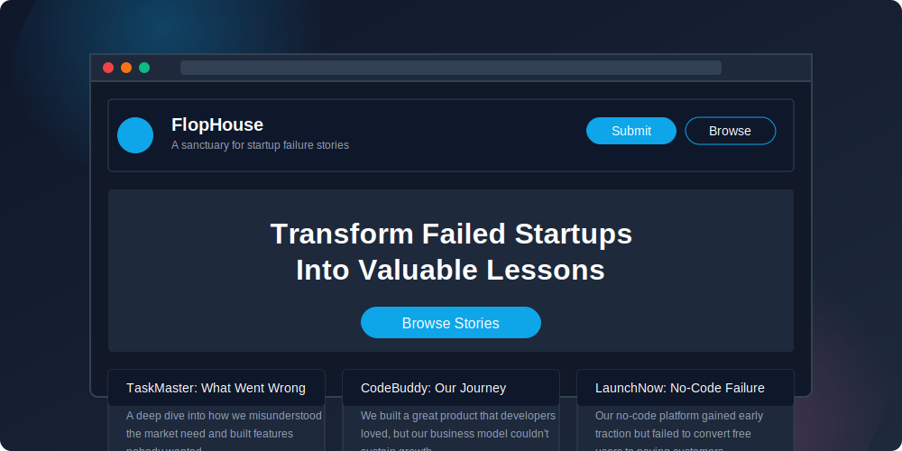

<div align="center">
  
# 🏚️ FlopHouse

**A curated sanctuary for failed startup stories.**

[](https://app.netlify.com/sites/flophouse/deploys)
[](https://github.com/edcadet10/FlopHouse/issues)
[](LICENSE)
[](https://nextjs.org/)
[](https://www.typescriptlang.org/)

<p align="center">
  <b>Key Features</b> &nbsp;|&nbsp; 
  <b>Tech Stack</b> &nbsp;|&nbsp; 
  <b>Getting Started</b> &nbsp;|&nbsp; 
  <b>Workflows</b> &nbsp;|&nbsp; 
  <b>Architecture</b> &nbsp;|&nbsp; 
  <b>Deployment</b> &nbsp;|&nbsp; 
  <b>Learn More</b>
</p>

</div>

## 🌟 Overview

**FlopHouse** is an elegant platform where founders can share and learn from startup failures. Transforming setbacks into stepping stones, the platform helps entrepreneurs avoid common pitfalls by creating a knowledge repository of valuable lessons.

<div align="center">
  
</div>

## ✨ Key Features

- **📝 Submit Failed Startup Stories** — Multi-step form with validation and structured data collection
- **🔍 Browse & Filter Stories** — Advanced filtering by industry, failure reason, and search functionality  
- **💡 Rich Story Display** — Full markdown support with custom styling and responsive design
- **⚙️ Admin Review System** — Netlify CMS interface for story approval and content management
- **💬 Community Comments** — Discussion system for each story with moderation capabilities
- **🎯 Responsive Design** — Mobile-first interface following UX design principles
- **⚡ Static Site Generation** — Optimized performance with Next.js static export
- **🔒 Secure Content Pipeline** — GitHub-based storage with admin approval workflow

## 🛠️ Tech Stack

<div align="center">
  
| Frontend | Content Management | Backend | Deployment |
|:--------:|:------------------:|:-------:|:----------:|
|  |  |  |  |
|  |  |  |  |
|  |  |  | |
|  | | | |

</div>

**Key Dependencies:**
- **UI Framework:** Radix UI + shadcn/ui components
- **Form Handling:** React Hook Form + Zod validation  
- **Content Processing:** gray-matter + marked (Markdown parsing)
- **GitHub Integration:** Octokit REST API
- **Styling:** Tailwind CSS + CSS custom properties

## 💻 Getting Started

### Prerequisites

- Node.js 16.x or higher
- npm or yarn

### Installation

```bash
# Clone the repository
git clone https://github.com/edcadet10/FlopHouse.git

# Navigate to the project folder
cd FlopHouse

# Install dependencies
npm install

# Set up environment variables
cp .env.example .env.local
# Edit .env.local with your GitHub and Netlify credentials

# Start the development server
npm run dev
```

Visit [http://localhost:3000](http://localhost:3000) to see the application in your browser.

**Admin Interface:** Access [http://localhost:3000/admin](http://localhost:3000/admin) for content management.

## 🔄 Content Management Workflow

### Story Submission and Review Process

1. **User Submission**:
   - Users submit stories through the `/submit` form with multi-step validation
   - Submissions are processed by the `story-submission.js` Netlify function
   - Valid submissions are stored as markdown files in the `content/submissions` directory via GitHub API

2. **Admin Review**:
   - Admins access the Netlify CMS at `/admin` to review pending submissions
   - The CMS provides an editorial interface with draft/review/approval workflow
   - Admins can edit, approve, or reject submissions with approval actions

3. **Publication**:
   - Approved stories are moved to the `content/stories` directory with `published: true`
   - Published stories appear on the main site with proper categorization and filtering
   - The `get-stories.js` function retrieves published stories from GitHub for display

4. **Content Structure**:
   ```
   content/
   ├── submissions/        # Pending review stories
   ├── stories/           # Published stories
   ├── comments/          # Story comments (JSON format)
   └── contact-messages/  # Contact form submissions
   ```

The platform follows established UX design principles for optimal user experience:

| Principle | Implementation |
|-----------|----------------|
| **Hick's Law** | Minimal actions per screen. All CTAs limited to 1–2 per context. |
| **Fitts's Law** | Primary touch targets ≥ 44px. Navigation optimized for thumb zones. |
| **Miller's Law** | Core workflows contain no more than 5–7 options at once. |
| **Jakob's Law** | Navigation, cards, dropdowns follow standard web patterns. |
| **Law of Prägnanz** | Extensive white space, clear hierarchy, minimal visual elements. |
| **Doherty Threshold** | Interactions complete <400ms with optimized animations. |

## 🏗️ Architecture

FlopHouse uses a modern JAMstack architecture with GitHub-based content management:

```
FlopHouse/
├── app/                     # Next.js App Router
│   ├── browse/              # Story browsing with filters
│   ├── submit/              # Multi-step submission form
│   ├── story/[id]/          # Dynamic story pages
│   ├── about/               # About page
│   ├── contact/             # Contact form
│   └── layout.tsx           # Root layout with theme provider
├── components/              # Reusable UI components
│   ├── home/                # Homepage-specific components
│   ├── layout/              # Header, footer, navigation
│   └── ui/                  # shadcn/ui component library
├── content/                 # GitHub-managed content
│   ├── stories/             # Published markdown stories
│   ├── submissions/         # Pending review stories
│   ├── comments/            # Story discussions (JSON)
│   └── contact-messages/    # Contact form data
├── netlify/functions/       # Serverless API endpoints
│   ├── story-submission.js  # Handle form submissions
│   ├── get-stories.js       # Fetch published stories
│   ├── get-story.js         # Fetch individual stories
│   ├── story-comments.js    # Handle comment system
│   └── contact-form.js      # Process contact forms
├── public/admin/            # Netlify CMS configuration
│   ├── config.yml           # CMS content types
│   ├── index.html           # Admin interface
│   └── *-workflow.js        # Custom approval workflows
└── styles/                  # Global styles and themes
    └── globals.css          # Tailwind + custom CSS
```

### Data Flow
1. **Content Creation**: Stories submitted via form → GitHub API → `/content/submissions/`
2. **Content Review**: Admin accesses `/admin` → Netlify CMS → Approval workflow
3. **Content Publication**: Approved content moves to `/content/stories/` → Site rebuild
4. **Content Display**: Netlify Functions fetch from GitHub → Static pages → User interaction

## 🚀 Deployment

The application uses automated deployment with Netlify:

### Deployment Pipeline
1. **Build Process**: Next.js static export generates optimized HTML/CSS/JS
2. **Functions Deployment**: Netlify automatically deploys serverless functions
3. **Content Management**: Netlify Identity + Git Gateway enables CMS access
4. **CDN Distribution**: Global edge caching for optimal performance

### Environment Variables

Create a `.env.local` file with the following variables:

```env
# GitHub Integration (Required)
GITHUB_TOKEN=your_personal_access_token
GITHUB_OWNER=edcadet10
GITHUB_REPO=FlopHouse
GITHUB_BRANCH=main

# Netlify Integration (Optional)
NETLIFY_SITE_ID=your_netlify_site_id
NETLIFY_AUTH_TOKEN=your_netlify_auth_token
```

### Setup Instructions

1. **GitHub Setup**:
   - Generate a Personal Access Token with `repo` scope
   - Set `GITHUB_TOKEN` in your Netlify environment variables

2. **Netlify CMS Setup**:
   - Enable Netlify Identity in your site settings
   - Enable Git Gateway in Identity settings  
   - Connect Git Gateway to your GitHub repository
   - Access admin interface at `/admin`

3. **Production Deployment**:
   - Push to main branch triggers automatic deployment
   - Netlify Functions handle dynamic content operations
   - CDN serves static assets globally

> **Note:** Never commit your `.env` files to Git. Use Netlify's environment variable interface for production.

## 🛠️ Development

### Available Scripts

```bash
# Development server with hot reload
npm run dev

# Build for production
npm run build

# Start production server
npm start

# Lint code
npm run lint

# Fix submission data format (utility)
npm run fix-submissions
```

### Project Structure

- **`/app`**: Next.js App Router pages and layouts
- **`/components`**: Reusable React components with TypeScript
- **`/netlify/functions`**: Serverless API endpoints
- **`/content`**: GitHub-managed markdown content
- **`/public/admin`**: Netlify CMS configuration and interface
- **`/styles`**: Global CSS with Tailwind and custom properties

### Development Workflow

1. **Local Development**: Run `npm run dev` for hot-reload development server
2. **Content Testing**: Use `/admin` interface to test content workflows
3. **Function Testing**: Netlify Functions accessible at `/.netlify/functions/`
4. **Build Testing**: Run `npm run build` to verify static export
5. **Deployment**: Push to main branch for automatic Netlify deployment

## 📚 Learn More

### Documentation
- [Next.js Documentation](https://nextjs.org/docs) - React framework features
- [Netlify Functions](https://docs.netlify.com/functions/overview/) - Serverless functions
- [Netlify CMS](https://www.netlifycms.org/docs/) - Content management system
- [Tailwind CSS](https://tailwindcss.com/docs) - Utility-first CSS framework
- [shadcn/ui](https://ui.shadcn.com/) - Component library documentation

### Resources
- [GitHub API](https://docs.github.com/en/rest) - Content storage and management
- [Radix UI](https://www.radix-ui.com/) - Unstyled component primitives
- [React Hook Form](https://react-hook-form.com/) - Form validation and handling
- [Zod](https://zod.dev/) - TypeScript-first schema validation

### Community
- [Next.js Discord](https://nextjs.org/discord) - Framework support
- [Tailwind CSS Discord](https://tailwindcss.com/discord) - Styling questions
- [Netlify Community](https://community.netlify.com/) - Deployment and hosting

## 📄 License

This project is licensed under the MIT License - see the [LICENSE](LICENSE) file for details.## 📄 License

This project is licensed under the MIT License - see the [LICENSE](LICENSE) file for details.

---

<div align="center">
  
Made with ❤️ by [FlopHouse Team](https://github.com/edcadet10)


</div>
